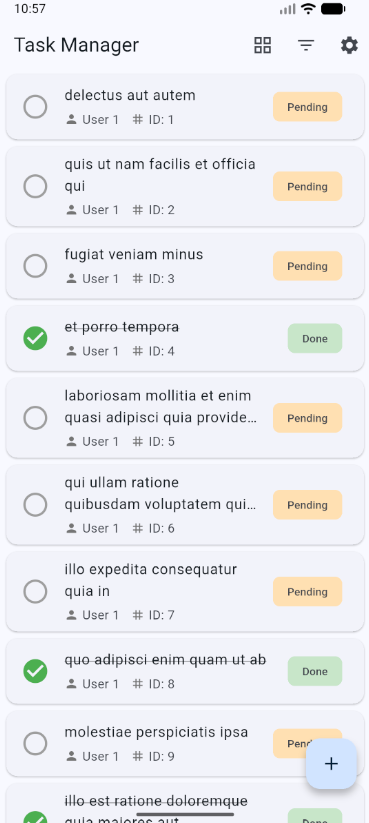
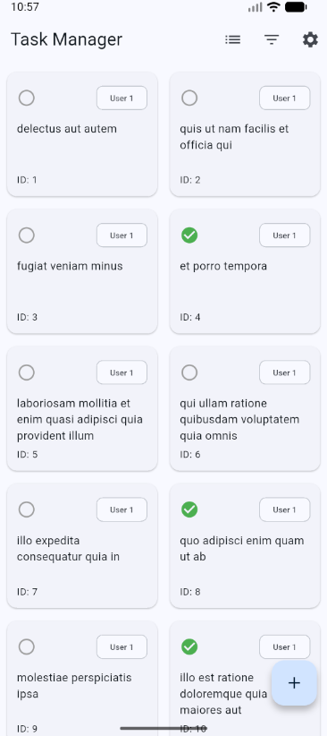
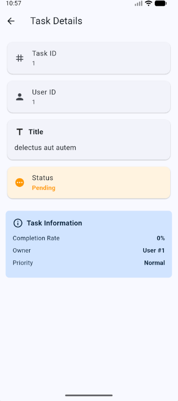
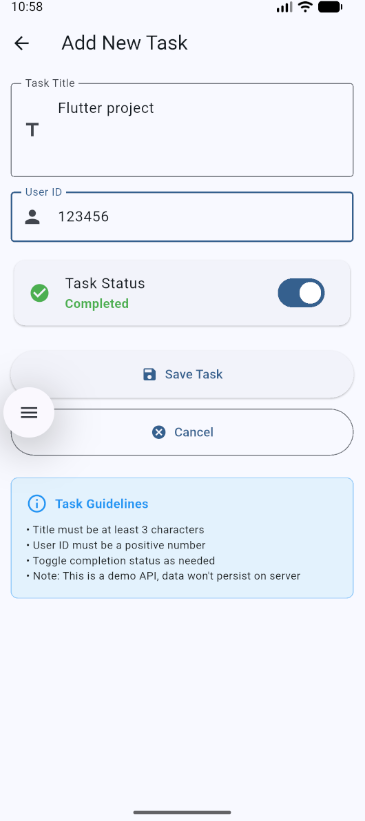
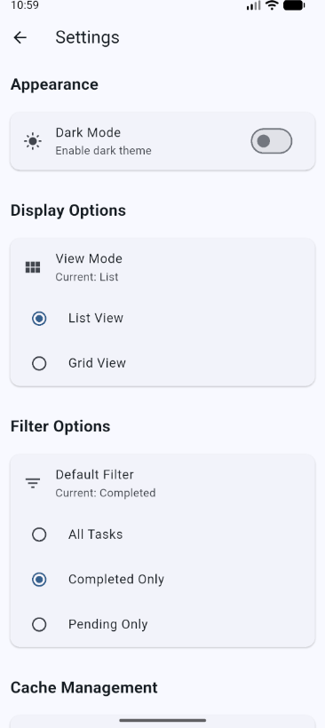
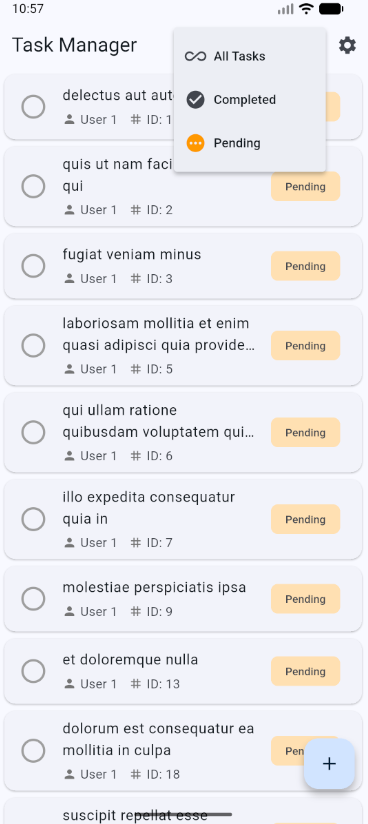
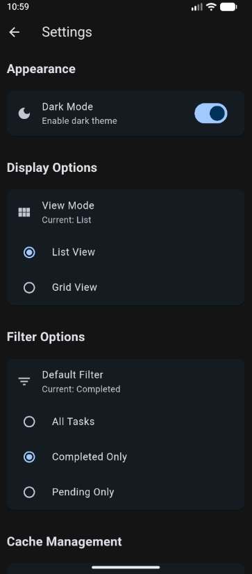

# Task Manager - Flutter App

A full-featured task management application built with Flutter that demonstrates API integration, dynamic lists, and local data persistence.

## 📱 Features Implemented

### Core Features
- ✅ **Home Screen with Task List**
  - Display tasks fetched from REST API
  - Show task title, completion status, and user ID
  - Efficient scrolling with ListView.builder
  - Pull-to-refresh functionality
  - Loading indicators
  - Error handling with retry option
  - Floating action button to add new tasks

- ✅ **Multiple View Modes**
  - List view for detailed task information
  - Grid view for compact overview
  - Toggle between views with persistent preference

- ✅ **Task Filtering**
  - Filter by All tasks
  - Filter by Completed tasks only
  - Filter by Pending tasks only
  - Persistent default filter preference

- ✅ **Task Detail Screen**
  - Full task details when tapped
  - Display task ID, user ID, title, and completion status
  - Clean, card-based UI design
  - Back navigation

- ✅ **Add Task Screen**
  - Form to create new tasks
  - Title field with validation (minimum 3 characters)
  - User ID field with validation (must be positive number)
  - Completion status toggle
  - Save and Cancel buttons
  - Form validation with error messages
  - Loading state during submission

- ✅ **Settings Screen**
  - Dark mode toggle with persistence
  - View mode selection (List/Grid)
  - Default filter selection
  - Cache management
  - About information

- ✅ **Local Data Persistence**
  - Cache API responses using SharedPreferences
  - Save user preferences (theme, view mode, default filter)
  - Show cached data when offline
  - Display offline indicator
  - Cache expiration handling (30 minutes)

## 🌐 API Integration

### Endpoints Used

**Base URL:** `https://jsonplaceholder.typicode.com`

1. **GET /todos** - Fetch all tasks
2. **GET /todos/{id}** - Fetch single task
3. **POST /todos** - Create new task

### API Service Features
- Timeout handling (10 seconds)
- Comprehensive error handling
- HTTP status code validation
- JSON parsing with model classes

## 🛠️ Technologies & Packages

- **Flutter SDK:** 3.0.0+
- **http:** ^1.1.0 - HTTP requests
- **shared_preferences:** ^2.2.2 - Local data persistence

## 📁 Project Structure

```
lib/
├── main.dart                      # App entry point and theme management
├── models/
│   └── task.dart                  # Task model with JSON parsing
├── services/
│   ├── api_service.dart           # HTTP requests and API integration
│   └── cache_service.dart         # Local storage and preferences
├── screens/
│   ├── home_screen.dart           # Main task list screen
│   ├── task_detail_screen.dart    # Task details display
│   ├── task_form_screen.dart      # Add new task form
│   └── settings_screen.dart       # App settings
└── widgets/
    └── task_card.dart             # Reusable task list item
```

## 🚀 How to Run

### Prerequisites
- Flutter SDK (3.0.0 or higher)
- Android Studio / VS Code with Flutter extensions
- Android Emulator / iOS Simulator / Physical Device

### Installation Steps

1. **Clone the repository**
   ```bash
   git clone https://github.com/YOUR_USERNAME/task_manager.git
   cd task_manager
   ```

2. **Install dependencies**
   ```bash
   flutter pub get
   ```

3. **Run the app**
   ```bash
   flutter run
   ```

## ✨ Key Features 

### 1. API Integration
The app uses the JSONPlaceholder fake REST API to demonstrate:
- GET requests to fetch tasks
- POST requests to create new tasks
- Proper error handling for network failures
- Timeout management

### 2. Offline Mode
When internet connection is unavailable:
- App automatically loads cached tasks
- Displays "Offline" indicator in app bar
- Allows users to view previously loaded tasks
- Gracefully handles cache expiration

### 3. User Preferences
All user preferences are persisted locally:
- Dark mode setting
- View mode (List/Grid)
- Default task filter
- Preferences survive app restarts

### 4. Dynamic Lists
- **ListView:** Efficient scrolling with ListView.builder
- **GridView:** Compact 2-column grid layout
- Both views update dynamically based on filters
- Pull-to-refresh on both view modes

### 5. Form Validation
Add task form includes:
- Required field validation
- Minimum length validation (3 characters)
- Numeric validation for User ID
- Real-time error messages
- Disabled button during submission

## 📸 Screenshots

Note: Add your screenshots in a `screenshots/` directory with the following names:
-  - Home screen in list view
-  - Home screen in grid view
-  - Task detail screen
-  - Add task form
-  - Settings screen
-  - Filter options
-  - Dark mode

## 🎓 What I Learned

### Technical Skills
- Making HTTP requests with the `http` package
- Parsing JSON data into Dart objects
- Using FutureBuilder for async operations
- Implementing efficient lists with builders
- Local data persistence with SharedPreferences
- State management in Flutter
- Error handling and user feedback
- Separating concerns (models, services, screens)
- Proper resource management and disposal
- User experience considerations (loading states, error handling)
- Offline-first approach with caching
- Form validation and user input handling

### Challenges Faced
1. Implementing proper cache expiration and fallback logic
2. Keeping UI in sync after CRUD operations
3. Detecting network failures and loading cached data
4. Ensuring data integrity before API submission


